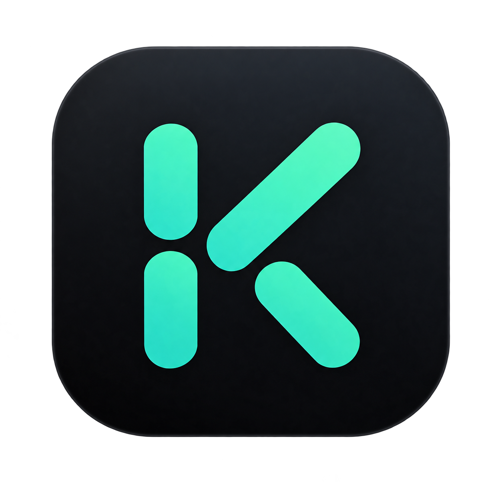

<div align="center">
  
  <h1>Kiora</h1>
  <p><strong>Keep It Organized, Right Away</strong> · v1.0.0 — panel personal local-first: tareas, notas, finanzas, deseos, metas y clima. Tus hábitos reales se convierten en koins, y tus koins en tu propia identidad visual.</p>
  <p>
    <a href="#que-es">Qué es</a> •
    <a href="#caracteristicas">Características</a> •
    <a href="#economia-gamificada">Economía gamificada</a> •
    <a href="#tienda-de-personalizacion">Tienda</a> •
    <a href="#arquitectura">Arquitectura</a> •
    <a href="#permisos">Permisos</a> •
    <a href="#sincronizacion-con-n8n">Sincronización n8n</a> •
    <a href="#instalacion">Instalación</a> •
    <a href="#desarrollo">Desarrollo</a> •
    <a href="#licencia">Licencia</a>
  </p>
  <p>
    
    
    
    
  </p>
</div>

---

## Qué es

Kiora es una app local-first de productividad personal que **te paga por tus hábitos**: completar tareas, avanzar metas o reportar problemas visuales genera koins, y esas koins se gastan en una tienda que transforma la apariencia de toda la app (temas, fondos, colores, brillos y movimientos).

Sin cuenta, sin nube obligatoria y sin publicidad. Toda la información vive en tu dispositivo en SQLite (modo WAL, 13 tablas); los únicos accesos de red son:

1. **Clima** — geolocalización por IP (ipwho.is, sin API key ni permiso de ubicación) + pronóstico Open-Meteo.
2. **Metadatos de enlaces** (Deseos) — resolución de título/imagen vía `noembed.com` (tercero, sin SLA).
3. **Puente n8n (opcional)** — un servidor Express self-hosted para automatizaciones.

## Características

| Sección | Qué hace |
|---|---|
| **Inicio** | Saludo según la hora, fecha, clima actual + ciudad (modal de detalle con humedad, viento y sensación), salud financiero del período y metas en curso. Todo enlaza a su pestaña. |
| **Balances** | Ingresos y gastos por categoría con estadísticas mensuales, semanales, anuales y desglose anual por mes. **Tocar** un movimiento abre su detalle completo (descripción, categoría, fecha/hora, origen recurrente); **mantener presionado** lo edita. La edición fija el tipo: un movimiento recurrente solo se edita como recurrente y un puntual solo como puntual. |
| **Tareas** | Prioridades, categorías, fechas límite, recordatorios (notificación local + evento de calendario), filtros y búsqueda. |
| **Notas** | Notas rápidas con títulos, fijadas al inicio y **vínculos entre notas y entidades** (tarea, meta, deseo) para contexto cruzado. |
| **Deseos** | Wishlist con precio, categoría e imagen local (JPEG re-encodificado, sin metadatos EXIF). Título y foto se autocompletan desde el enlace del producto; en el detalle, tocar la foto la reemplaza desde la galería. |
| **Metas** | Cuatro modalidades: objetivo con pasos, ahorro con aportes libres, alcancía por periodos y pago en cuotas programadas. Detalle tipo mapa mental (canvas con nodos y curvas), tutoría visual tipo coach-marks y finalización automática al cubrir todo. |
| **Ajustes** | Perfil editable, tema claro/oscuro/sistema, tienda de personalización, sincronización n8n (URL local + API key en SecureStore), limpieza de notificaciones y borrado de datos por categorías (estilos / finanzas / todo) con confirmación en 3 pasos. |
| **Onboarding y splash** | Presentación de cada sección; splash con logo K, gradiente responsivo al tema y órbita animada. |

## Economía gamificada

Las koins se ganan por acciones concretas y se gastan en la tienda. El saldo se lee de la base de datos y se refresca en cada foco de la tienda:

| Acción | Koins |
|---|---|
| Completar una tarea | +10 |
| Completar un paso de meta | +5 |
| Finalizar una meta | +50 |
| Reportar un problema visual (configuración única) | +100 |
| Card "150 koins gratis" (una vez) | +150 |

La card "+150 koins gratis" aparece sobre el acordeón de Recomendados y alcanza exactamente para comprar un conjunto completo de la tienda.

## Tienda de personalización

Cada categoría se desbloquea con koins y se aplica a **toda** la app en tiempo real:

| Categoría | Catálogo (v1.0.0) | Notas |
|---|---|---|
| Temas | 51 (50 de pago + Original) | Paleta completa claro/oscuro por tema |
| Fondos | 20 | Figuras SVG: círculos, diamantes, triángulos, anillos, ondas… |
| Colores de botones | 56 | Tonalidades propias + modo automático |
| Pares de gráficas | 15 | Paletas para estadísticas; vista previa con mini-gráfico de barras |
| Capas de movimiento | 15 | Ritmos sobre los fondos según la energía del estilo |
| Brillos (glow) | 28 | Intensidad ajustable; modo automático y arcoíris |
| Combos conceptuales | 20 | 6 estilos coherentes entre sí, equipables de un toque |

Comportamiento de las cards:

- **Sin comprar**: icono de koins centrado con el precio debajo (sin botón). Tocar pide confirmación; en los combos solo se desbloquea lo que falta en un pago único.
- **Compradas**: sin precio; tocar equivale a equipar (en los combos, con una carga breve).
- La guía completa de cada acordeón está dentro de la app (icono de ayuda de la tienda).

## Arquitectura

```
app/*.tsx (pantallas expo-router)
   └─ hooks/*.ts (estado por dominio)
        └─ lib/storage/*.ts (SQLite) y lib/theme/* (tienda de estilos)
             └─ lib/storage/db.ts (singleton SQLite, WAL)
```

- **Datos**: SQLite (`kiora.db`, WAL, 13 tablas). Las pantallas nunca tocan SQLite directamente.
- **Persistencia auxiliar**: AsyncStorage solo para el modo de tema; SecureStore para la API key del bridge; la URL de sincronización vive en la tabla `settings`.
- **IDs**: `generateId()` (base36 con contador); para código nuevo se prefiere `crypto.randomUUID()` (el runtime Hermes lo soporta).
- **Tema**: catálogos en `lib/theme/presets/`; se consume vía `useTheme()` y hooks de tienda; barrel en `lib/theme/index.ts`.
- **Seguridad en build**: plugin `withAndroidSecurity.js` fija `allowBackup=false` y elimina permisos no usados del manifest. No hay variables `EXPO_PUBLIC_*`: las claves van configuradas por el usuario dentro de la app.
- **Configuración plataforma**: New Architecture (Fabric) activada, `edgeToEdge` con barra de navegación oculta y `predictiveBackGesture` desactivado.

Más detalles de implementación en [`structure.md`](./structure.md); debilidades y decisiones técnicas en [`readmedev.md`](./readmedev.md).

## Permisos

| Permiso | Cuándo se pide | Notas |
|---|---|---|
| Notificaciones | Primer arranque con sesión | Recordatorios de tareas y avisos locales (no hay push) |
| Calendario | Primer arranque con sesión | Tareas con fecha límite se pueden volcar al calendario del dispositivo |
| Fotos / librería | Al elegir imagen de un deseo (iOS) | Android 13+ usa el Photo Picker del sistema sin pedir permiso |
| Lectura de SMS | Flujo de importación de Balances | Restricción especial, ver abajo |

**Estado de la importación SMS**: expo-prebuild elimina el módulo nativo `SmsReader` y el permiso `READ_SMS` por higiene de build. El plugin `plugins/withSmsReader.js` los re-inyecta en cada prebuild (módulo Kotlin + READ_SMS en el manifest; con New Architecture el interop mantiene el puente legacy). En Android 14+ el sistema exige la activación manual del permiso si la app no viene de Play Store.

## Sincronización con n8n

El puente (`api/server.js`) es una app Express que escucha en `PORT` (3001 por defecto) y requiere `KIORA_API_KEY` en `api/.env` (no en la raíz del repo).

| Endpoint | Método | Función |
|---|---|---|
| `/api/expense` | POST | Recibe un gasto desde una automatización de n8n |
| `/api/expense/:id` | DELETE | Elimina un movimiento pendiente |
| `/api/expense/pending` | GET | Lista los movimientos pendientes de sincronizar |
| `/api/report` | POST | Reenvía un reporte de la app por email (SendGrid, con `SENDGRID_API_KEY` y `REPORT_TO`) |
| `/api/health` | GET | Healthcheck del bridge |

Autenticación `Authorization: Bearer <KIORA_API_KEY>` con `timingSafeEqual`, rate-limit por IP y cola persistente en `pending.json` (escritura atómica tmp+rename bajo mutex en proceso). El HTTPS queda a cargo del host (p. ej. Render).

La app importa y confirma movimientos desde Ajustes → Sincronización n8n; reportes y clave viajan solo en SecureStore, nunca embebidos en el bundle.

## Stack tecnológico

| Capa | Tecnología |
|---|---|
| Framework | React Native 0.81 (New Architecture) + Expo SDK 54 |
| Routing | Expo Router (file-based) |
| Lenguaje | TypeScript 5.9 (strict) |
| Base de datos | expo-sqlite · SQLite con WAL (13 tablas) |
| Estado | Hooks locales + contexto de tema (sin Redux/Zustand) |
| Ambiente | react-native-reanimated 4, react-native-svg, gesture-handler, safe-area-context, keyboard-controller |
| Persistencia | expo-secure-store, AsyncStorage, expo-file-system (imágenes de deseos) |
| Clima | ipwho.is (geo por IP) + Open-Meteo |
| Recordatorios | expo-notifications + expo-calendar |
| UI | Componentes propios + `@expo/vector-icons` (Ionicons; sin emojis) |
| Media | expo-image-picker + expo-image-manipulator (re-encode JPEG) |
| Bridge | Node.js + Express (self-hosted) |

## Instalación

```bash
git clone https://github.com/DilanSG/kiora.git
cd kiora

npm install
npx expo start        # Metro: Android, iOS o Web (tecla "w")
```

Requisitos: Node.js 20+, Android Studio / Xcode según plataforma, o `npx expo start --tunnel` para dispositivos físicos.

## APK

Build de Android con EAS (perfil `preview`, APK de distribución interna):

```bash
npx eas build --platform android --profile preview
```

También se puede compilar localmente:

```bash
npx expo prebuild --platform android
cd android && ./gradlew assembleRelease
# APK en android/app/build/outputs/apk/release/
```

El build release se firma con el keystore de depuración (adecuado para distribución interna). Tras `prebuild`, el plugin `withSmsReader.js` re-inyecta la lectura de SMS y `withAndroidSecurity.js` ajusta el manifest.

## Desarrollo

```bash
npm run typecheck   # único gate de verificación (tsc --noEmit)
npm run android     # expo run:android
npm run ios         # expo run:ios
npm run web         # sirve el export web (scripts/serve-web.cjs)
node api/server.js  # bridge n8n (necesita api/.env con KIORA_API_KEY)
```

- **CI** (`.github/workflows/ci.yml`): corre `npm run typecheck`.
- **Pantalla de QA**: oculta detrás del área invisible del footer de Ajustes — seed de datos de prueba, estadísticas de la DB, desbloqueo de la tienda, prueba de metadatos y sincronización manual.
- No hay lint ni suite de tests automatizada; el gate es `tsc --noEmit`.


## Licencia

**MIT License (with Non-Commercial Distribution Restriction)** — Copyright (c) 2024 IntoCode

```
MIT License (with Non-Commercial Distribution Restriction)

Copyright (c) 2024 IntoCode

Permission is hereby granted, free of charge, to any person obtaining a copy
of this software and associated documentation files (the "Software"), to deal
in the Software without restriction, including without limitation the rights
to use, copy, modify, merge, publish, distribute, sublicense, and/or sell
copies of the Software, and to permit persons to whom the Software is
furnished to do so, subject to the following conditions:

The above copyright notice and this permission notice shall be included in all
copies or substantial portions of the Software.

ADDITIONAL RESTRICTION — NON-COMMERCIAL DISTRIBUTION OF THE SOFTWARE:

Notwithstanding the foregoing, the following use is expressly prohibited
without the prior written permission of the copyright holder:

Distributing, selling, sublicensing, or otherwise making the Software
available to the public as a standalone product for monetization — including
but not limited to paid distribution, advertising, subscriptions, or in-app
purchases — regardless of whether the Software is distributed unmodified,
modified, or as part of a derivative work.

For the avoidance of doubt: personal, internal, non-commercial, educational,
and open-source use, modification, and distribution of the Software remains
fully permitted under the terms of the MIT License above. This restriction
applies solely to commercial distribution of the Software itself.

THE SOFTWARE IS PROVIDED "AS IS", WITHOUT WARRANTY OF ANY KIND, EXPRESS OR
IMPLIED, INCLUDING BUT NOT LIMITED TO THE WARRANTIES OF MERCHANTABILITY,
FITNESS FOR A PARTICULAR PURPOSE AND NONINFRINGEMENT. IN NO EVENT SHALL THE
AUTHORS OR COPYRIGHT HOLDERS BE LIABLE FOR ANY CLAIM, DAMAGES OR OTHER
LIABILITY, WHETHER IN AN ACTION OF CONTRACT, TORT OR OTHERWISE, ARISING FROM,
OUT OF OR IN CONNECTION WITH THE SOFTWARE OR THE USE OR OTHER DEALINGS IN THE
SOFTWARE.
```

---

<div align="center">
  <p>
    Desarrollado y mantenido por <strong>Dilan Acuña</strong> &mdash; Open source, libre y gratuito.
  </p>
  <p>
    <a href="https://github.com/DilanSG">DilanSG</a> •
    <a href="https://github.com/DilanSG/kiora/issues">Reportar un problema</a> (+100 koins)
  </p>
</div>